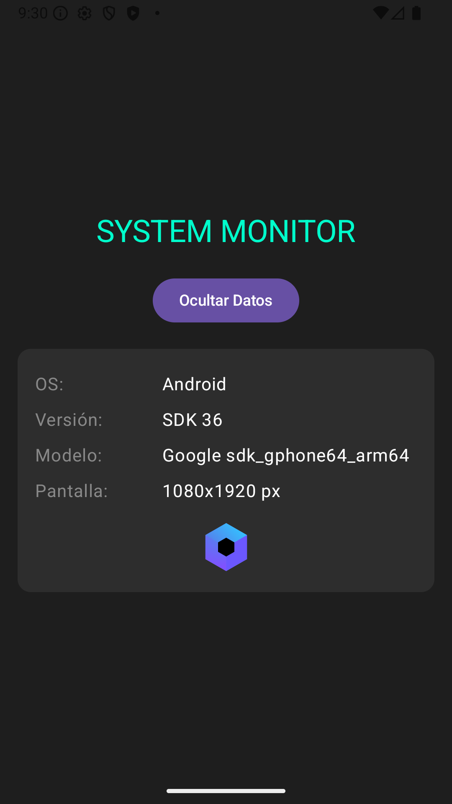

-----

# KMP Company Demo

Este repositorio contiene una aplicación de demostración ("Proof of Concept") desarrollada con **Kotlin Multiplatform (KMP)**. Implementa una arquitectura de **UI Híbrida**: utiliza **Jetpack Compose** para Android y **SwiftUI** nativo para iOS, compartiendo toda la lógica de negocio.

El objetivo de este proyecto es validar la viabilidad técnica y el flujo de trabajo de KMP para cumplir con los objetivos anuales de arquitectura móvil de la empresa.

## 🎯 Objetivos Cubiertos

Este demo implementa y valida los siguientes requerimientos estratégicos:

* **Configuration of KMP:** Configuración inicial robusta utilizando Gradle Kotlin DSL (`.kts`) y Version Catalogs (`libs.versions.toml`).
* **Multiplatform Build Configuration:** Estrategia de compilación unificada para targets Android y iOS (x64, arm64, simulador).
* **Language Interoperability:** Demostración bidireccional de interoperabilidad donde **SwiftUI** consume directamente clases de Kotlin (`DeviceMonitor`).
* **Monorepo Strategy:** Estructura de repositorio único que contiene tanto el código compartido como los clientes nativos (Android App y iOS App).

## 🛠 Requisitos Previos

Para ejecutar este proyecto, asegúrese de tener instalado el siguiente entorno:

* **JDK:** Versión 17 o superior.
* **Android Studio:** Versión recomendada Ladybug o superior (con plugin Kotlin Multiplatform Mobile instalado).
* **Xcode:** Versión 15+ (Requerido para compilar la target de iOS).
* **Cocoapods** (Opcional, si se decide cambiar la estrategia de gestión de dependencias; por defecto usa *Direct Embedding*).

## 📂 Estructura del Proyecto

El proyecto sigue una arquitectura Clean básica adaptada a KMP:

* **`composeApp`**: Módulo principal.
    * `commonMain`: Contiene la lógica de negocio compartida (`DeviceMonitor`) y la UI de Android (Compose).
    * `androidMain`: Implementaciones específicas de Android (acceso a `Resources`, `Build`).
    * `iosMain`: Implementaciones específicas de iOS (interacción con `UIKit`/`Foundation` vía Kotlin Native).
* **`iosApp`**: Proyecto nativo de Xcode (**SwiftUI**) que consume el módulo compartido como un Framework.

## 📸 Screenshots

Aquí se muestra la aplicación ejecutándose nativamente en ambas plataformas:

| Android (Jetpack Compose) | iOS (SwiftUI + KMP) |
|:---:|:---:|
|  |  |
| *UI implementada con Compose* | *UI nativa con SwiftUI consumiendo KMP* |

## 🚀 Cómo Ejecutar

### 1\. Clonar y Sincronizar

```bash
git clone https://github.com/CristianAc25/KMP-Avenga-Demo.git
cd KMP-Avenga-Demo
# Abra el proyecto en Android Studio y espere la sincronización de Gradle.
```

### 2\. Ejecutar en Android

1.  En Android Studio, seleccione la configuración de ejecución **`composeApp`**.
2.  Seleccione un emulador o dispositivo físico conectado.
3.  Click en **Run**.

### 3\. Ejecutar en iOS

**Opción A (Desde Android Studio):**

1.  Seleccione la configuración **`iosApp`** en el menú desplegable.
2.  Seleccione un simulador de iOS detectado.
3.  Click en **Run**.

**Opción B (Desde Xcode - Recomendado para depurar Swift):**

1.  Abra la carpeta `iosApp` con Xcode.
    ```bash
    open iosApp/iosApp.xcodeproj
    ```
2.  Espere a que Xcode indexe el proyecto (esto disparará una compilación de Gradle en segundo plano para generar el framework).
3.  Presione `Cmd + R` para ejecutar.

## 🔗 Detalles de Interoperabilidad

La demostración de interoperabilidad se encuentra gestionada por la clase `DeviceMonitor` y la interfaz `Platform`.

* **Kotlin -\> Nativo:** El módulo `iosMain` accede directamente a las APIs de Apple (`UIDevice`, `UIScreen`) utilizando `cinterop` y `@OptIn(ExperimentalForeignApi::class)`.
* **Swift -\> Kotlin:** El proyecto iOS utiliza **SwiftUI** puro. En lugar de embeber una vista de Compose, Swift instancia la clase Kotlin `DeviceMonitor` y consume sus datos (`DeviceInfo`) para renderizar la UI nativa.

-----

*Generado para demostración interna de arquitectura.*